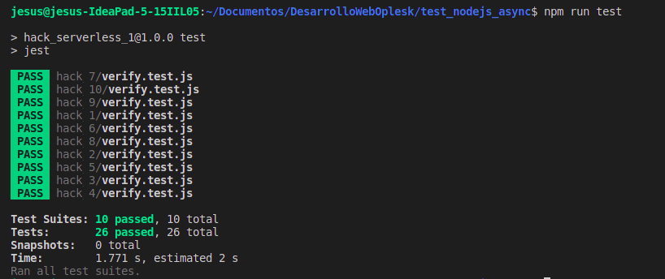

# SOCIAL OPLESK
### 🏴‍☠️ HACKS - ASYNC
### Jesús Daniel Ortega Briceño
## Resultados




|Hacks | Details | 
|----------|---------|
| H-1      | Axios - status: 200 &  method: GET    &   endpoint: /users/1   &  value: {"id": 1,"name": "Leanne Graham","username": "Bret" ...} |
| H-2      | Axios - status: 201 &  method: POST   &   endpoint: /posts     &  value: {"id":101} |
| H-3      | Axios - status: 200 &  method: PUT    &   endpoint: /posts/1   &  value: {"id":1} | 
| H-4      | Axios - status: 200 &  method: PATCH  &   endpoint: /posts/1   &  value: {"id":1, props...} |
| H-5      | Axios - status: 200 &  method: DELETE &   endpoint: /posts/1   &  value: {}  |
| H-6      | Axios - value: {"userId": 1, "id": 2,"title": "qui est esse",  "body": "est rerum ..."} |
| H-7      | Axios - value: {"userId": 3,"id": 30, "title": "a quo magni similique perferendis","body": "alias dolor ..."} | 
| H-8      | Fecth - value: 100 |
| H-9      | Fetch - value: {"id":101} |
| H-10     | Fetch - status: 200 & value: {"id":50} | 

<br/> 

## 🏆 H-1 (AXIOS)

```sh
status: 200 &  method: GET    &   endpoint: /users/1   &  value: {"id": 1,"name": "Leanne Graham","username": "Bret" ...}
```
<br/>

## 🏆 H-2 (AXIOS)
```sh
status: 201 &  method: POST   &   endpoint: /posts     &  value: {"id":101}
```
<br/>

## 🏆 H-3 (AXIOS)
```sh
status: 200 &  method: PUT    &   endpoint: /posts/1   &  value: {"id":1}
```
<br/>

## 🏆 H-4 (AXIOS)
```sh
status: 200 &  method: PATCH  &   endpoint: /posts/1   &  value: {"id":1, props...}
```
<br/>

## 🏆 H-5 (AXIOS)
```sh
status: 200 &  method: DELETE &   endpoint: /posts/1   &  value: {}
```
<br/>

## 🏆 H-6 (AXIOS)
```sh
value: {"userId": 1, "id": 2,"title": "qui est esse",  "body": "est rerum ..."}
```
<br/>

## 🏆 H-7 (AXIOS)
```sh
value: {"userId": 3,"id": 30, "title": "a quo magni similique perferendis","body": "alias dolor ..."}
```
<br/>

## 🏆 H-8 (FETCH)
```sh
 value: 100
```
<br/>

## 🏆 H-9 (FETCH)
```sh
 value: {"id":101}
```
<br/>

## 🏆 H-10 (FETCH)
```sh
status: 200 & value: {"id":50}
```
---
<h3 align="center">SOCIAL OPLESK</h3>
